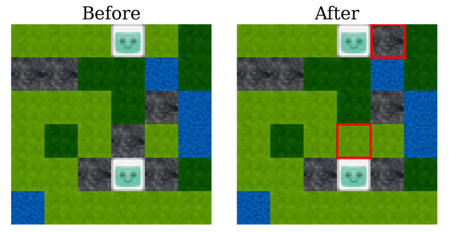

# Simulation-Driven Balancing of competitive Game Levels with Reinforcement Learning

This is the code base for the paper of the same name.

### TL;DR;
* Balance a tile-based game level for 2 players with reinforcement learning by swapping tiles.
* By playing the game multiple times with heuristic agents in simulations, the reinforcement learning
agent learns which tile swaps are most beneficial.
* Example: In this adapted game setting based within the NMMO environment, the players must forage
for resources (water/blue and food/dark green) in order to survive longest. Stones/grey and water impede movement. 
By swapping the highlighted tiles, the agent improved the balancing state:

<div style="text-align:center;">
    
</div>


## Contributions
* An architecture to simulation-driven balance game levels using the PCGRL framework.
* A novel swap-based representation pattern for PCGRL.
  * Implementations can be found in ```gym_pcgrl/envs/reps```
* A study using a derived game setting from the NMMO environment.
  * Implementations for simulation and balancing using PCGRL can be found in ```gym_pcgrl/envs/probs```


### Architecture

The architecture consists of 3 units:
* A level generating unit.
* The balancing unit based on PCGRL.
* A simulator of the game using heuristic agents.

<div style="text-align:center;">
    
</div>


### Demo

The little demo notebook (```balancing_demo.ipynb```) gives a broad overview of the code pipeline used. Trained PPO models for balancing and initial map generation are in ```/models```.


## Limitations
* Computational effort due to the simulation step in each reward calculation.
* Balancing is dependant on heuristic agents:
  * However, we can configure the balancing to balance e.g., for players of different skill or different types of players, mage vs. fighter, for instance.
* Simulating the game can be considered as sampling from the distribution of the true win rate. How often to sample depends
on the environment and heuristics which are used. We use a number of simulations between 10 and 20.

## Bibliography

If you use this code, please cite this paper:

```
@inproceedings{rupp_balancing_2023,
  author={Rupp, Florian and Eberhardinger, Manuel and Eckert, Kai},
  booktitle={2023 IEEE Conference on Games (CoG)}, 
  title={Balancing of competitive two-player Game Levels with Reinforcement Learning}, 
  year={2023},
  pages={1-8},
  doi={10.1109/CoG57401.2023.10333248}}
```


### Used code

#### Khalifa et al.: Pcgrl: Procedural Content Generation via Reinforcement Learning.

* The code in ```/gym_pcgrl``` is partially taken from the original code base [here](https://github.com/amidos2006/gym-pcgrl) (MIT License).
* For this research it has been extended and adjusted.

```
@inproceedings{khalifa_pcgrl_2020,
	title = {Pcgrl: {Procedural} content generation via reinforcement learning},
	volume = {16},
	booktitle = {Proceedings of the {AAAI} {Conference} on {Artificial} {Intelligence} and {Interactive} {Digital} {Entertainment}},
	author = {Khalifa, Ahmed and Bontrager, Philip and Earle, Sam and Togelius, Julian},
	year = {2020},
	pages = {95--101},
}
```

#### Joseph Suarez: The Neural MMO Environment

* The used tiles in ```/gym_pcgrl/envs/probs/nmmo``` is originally from the NMMO environment's official code base [here](https://github.com/NeuralMMO/environment), Version 1.6 (MIT License).
* For this research it has been extended and adjusted.

```
@misc{suarez_neural_2019,
	title = {Neural {MMO}: {A} {Massively} {Multiagent} {Game} {Environment} for {Training} and {Evaluating} {Intelligent} {Agents}},
	author = {Suarez, Joseph and Du, Yilun and Isola, Phillip and Mordatch, Igor},
	year = {2019},
	note = {arXiv:1903.00784}
}
```

#### Joseph Suarez: The Neural MMO Environment Baselines

* The code in ```/gym_pcgrl/scripted``` is originally from the NMMO environment's official baselines [here](https://github.com/NeuralMMO/baselines) (MIT License).
* For this research it has been extended and adjusted.